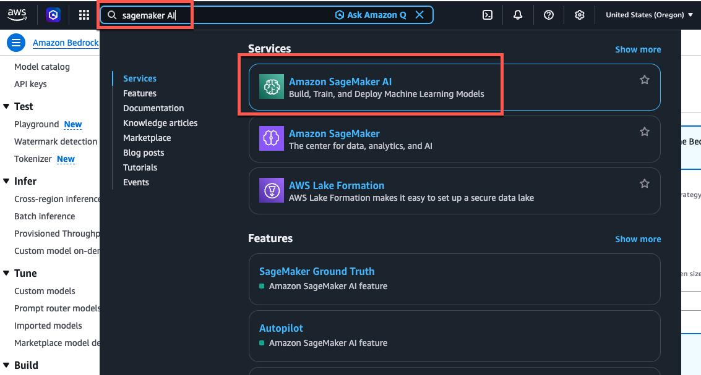
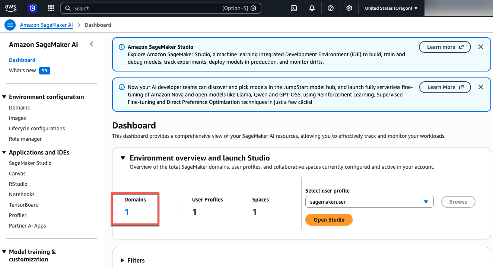
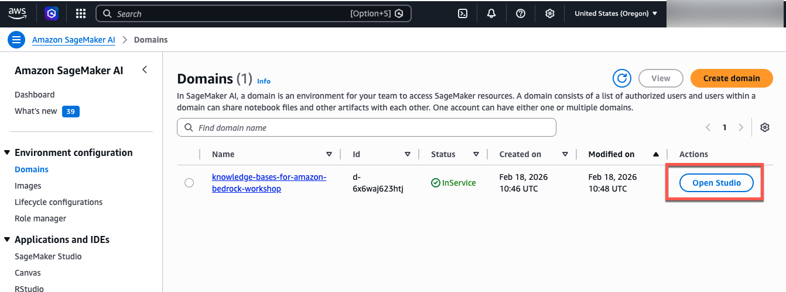
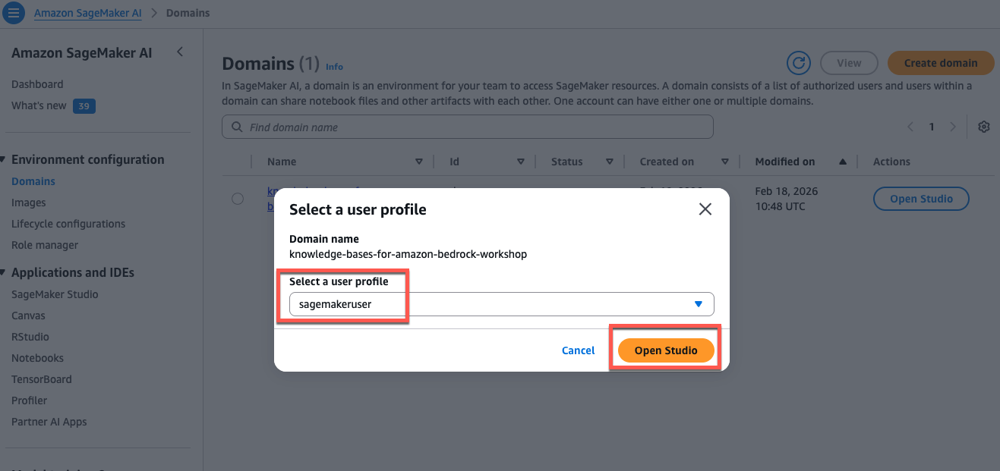
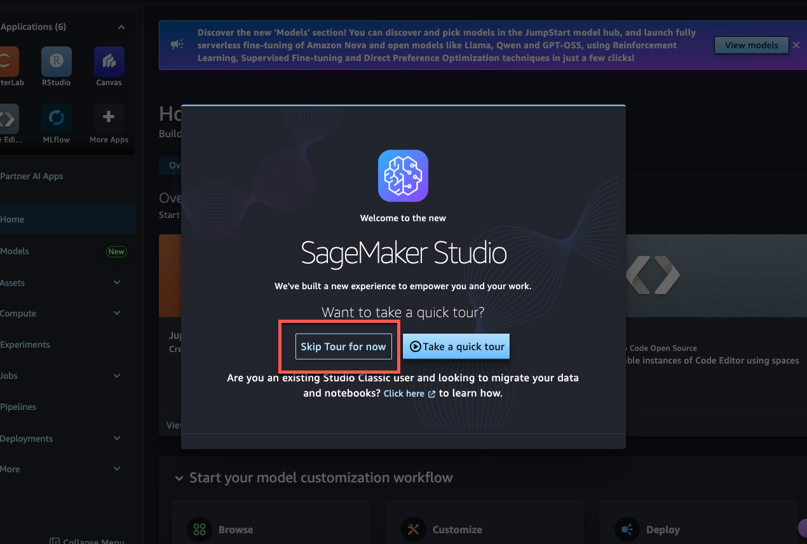
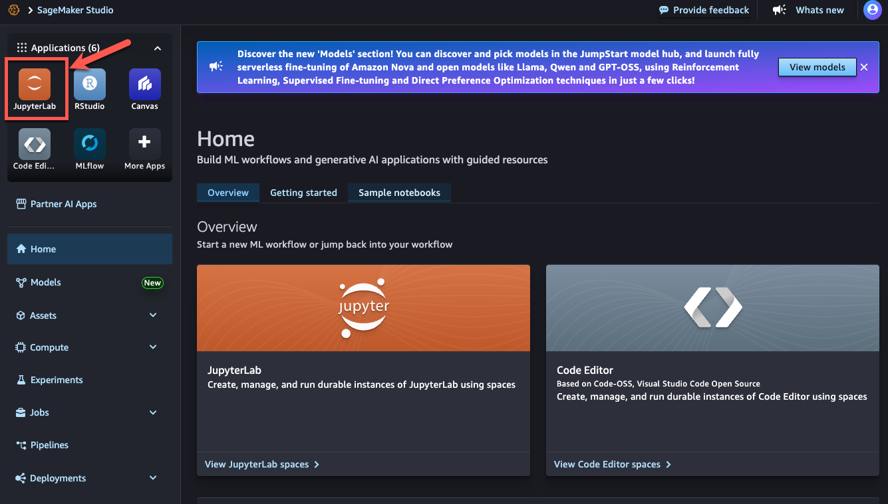
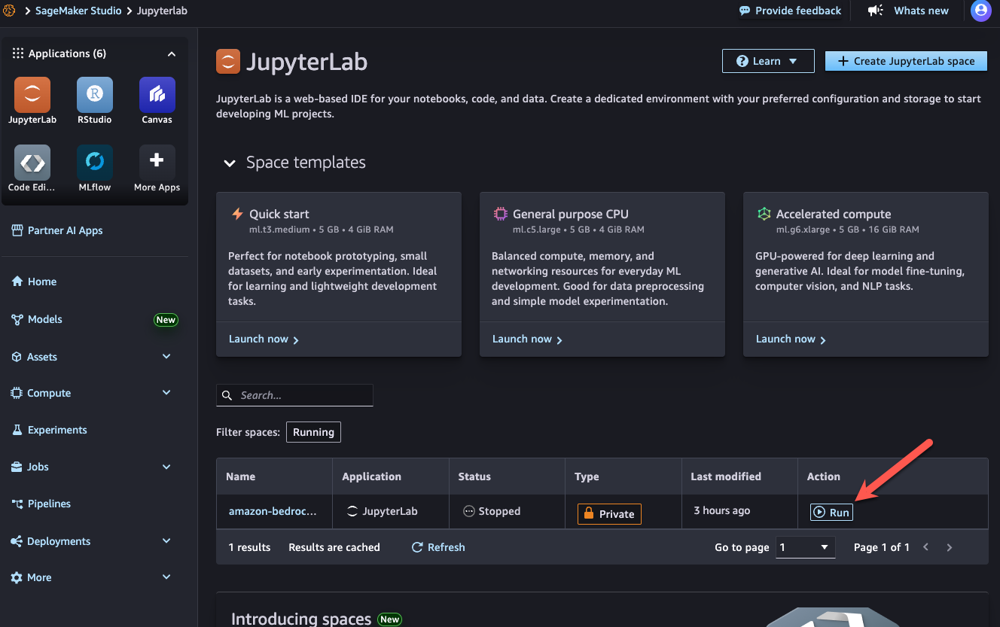
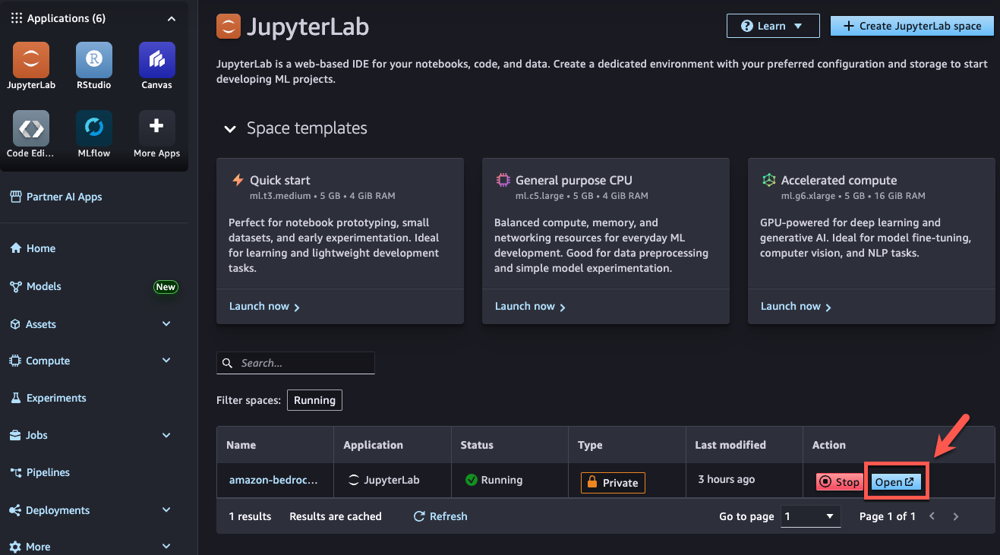
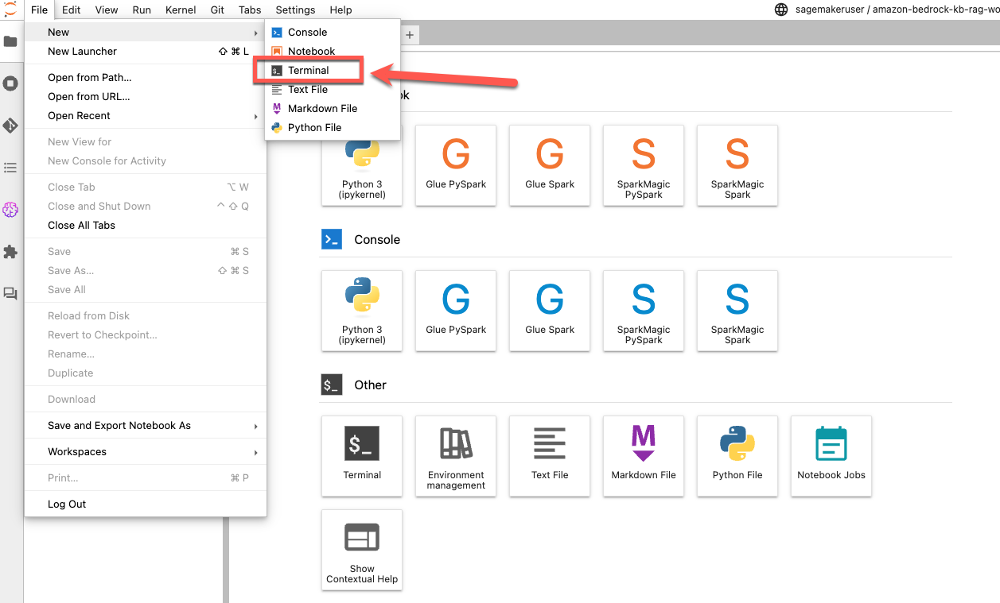
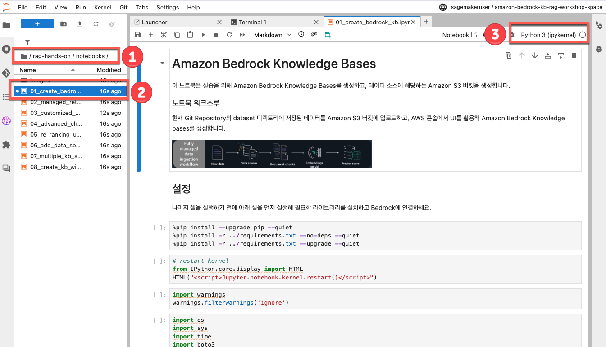

## Amazon Bedrock Knowledge Bases를 활용한 RAG 활용하기

### 실습 계정으로 시작하기

1. 이벤트 주최자가 제공하는 웹사이트 주소로 이동하여 Email one-time passoword (OTP) 버튼을 클릭합니다.


2. 본인의 사용 가능한 이메일 계정을 작성하고 Send Code 버튼을 클릭합니다.


3. 이메일 수신함에서 제목이 Your one-time passcode 이메일을 확인하고 passcode를 복사합니다. 복사한 passcode를 아래와 같이 붙여넣기 한 뒤, Sign in 버튼을 누릅니다.


4. 로그인이 성공적으로 이루어지면 아래와 같이 Review and Join 화면이 뜹니다.


5. 스크롤을 내려 Terms and Conditions 내용을 확인 한 뒤, "I agree with the Terms and Conditions"에 체크하고, Join event 버튼을 눌러 워크샵 이벤트를 시작합니다.


7. 워크샵 화면으로 전환 되었습니다.
- 좌측 상단 메뉴에서 워크샵 가이드를 확인 하며 실습을 따라 할 수 있습니다.
- 좌측 하단의 AWS account assesss 메뉴에서 링크를 클릭하여 AWS Console 창으로 접속 합니다.
- 또한, CLI 환경을 위한 Access Key와 Secret Access Key도 확인할 수 있습니다.


위의 단계를 모두 수행했다면 실습을 시작할 수 있습니다.


### 초기 환경 셋팅

1. AWS Console의 검색창에서 `SageMaker AI`를 검색하여 Amazon SageMaker AI 콘솔로 이동합니다. 


2. Dashboard를 보면 현재 Domain이 1개 존재합니다. 해당 링크를 선택합니다. 


3. 사전에 생성된 Domain을 확인할 수 있고 오른쪽의 [Open Studio] 버튼을 선택합니다. 


4. 프로필 선택 화면에서 자동으로 선택된 `sagemakeruser`를 확인한 후 [Open Studio] 버튼을 선택합니다. 


5. SageMaker Studio 웰컴 페이지에서 Skip Tour for now 버튼을 클릭합니다.


6. 왼쪽 상단의 JupyterLab 버튼을 클릭합니다.


7. JupyterLab space 목록에는 현재 amazon-bedrock으로 시작하는 한개의 항목만 존재합니다. 이 항목의 [Run] 버튼을 클릭합니다. Jupyter 노트북 인스턴스가 준비되는데 2~3분 정도 소요 됩니다. 


8. Jupyter 노트북 인스턴스가 준비되면 Open 버튼을 클릭합니다.


9. Jupyter 노트북 화면에서 File -> New -> Terminal을 선택합니다.


10. git clone 명령으로 실습용 노트북 파일들 내려받습니다. 
```
git clone https://github.com/YonghoChoi/rag-hands-on.git
```

11. 이제부터는 Amazon SageMaker AI의 Jupyter 노트북을 사용해서 실습을 진행합니다.
